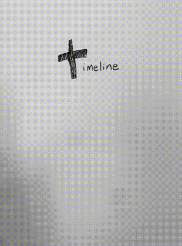
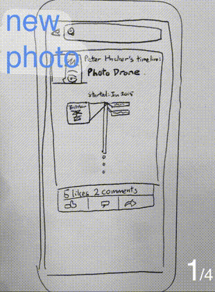

Timeline within timeline
=====
My response to the question: "What feature would you add to Facebook and why?"

I would add the ability to create a timeline within your own timeline. Why? Because some events have a life of their own. Pictures, comments and likes can come together in a better way to tell the story of that event.

Hey awesome people at Facebook! 
=====

Here's a visual outline of "timeline within timeline"

Why Lou (over the other good-but-not-as-good fish in the sea) for Facebook University?
=====
I have experience with tech that most freshman don't have
----
* I've worked in a team of seven people intensely for two weeks building a web app called [Unipop].
* I've worked with all sorts of technology, like *Rails*, deploying with *Heroku*, testing with *RSpec* and *Cucumber*, inspecting with *ngrok* and [much more]!
* I love technology. [Click here for photos of my tech escapades].
* I'm fun to have a techquila with

Thank you for considering me for such an exciting opportunity!

[Unipop]:https://github.com/StephanMusgrave/unipop
[Click here for photos of my tech escapades]:louiselai.com/tech-events
[much more]:https://github.com/StephanMusgrave/unipop#technologies-used