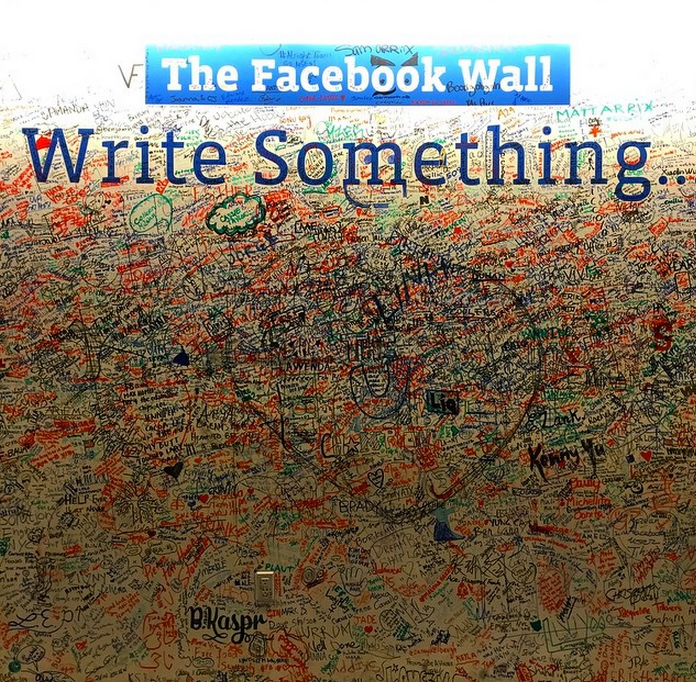

Timeline within timeline
=====
My response to the question: "What feature would you add to Facebook and why?"

I would add the ability to create a timeline within your own timeline. Why? Because some events have a life of their own. Pictures, comments and likes can come together in a better way to tell the story of that event.

Hey awesome people at Facebook! 
=====

Here's a visual outline of "timeline within timeline"

Why Lou for Facebook University?
=====
* **Quick to learn**: From 0 to my first web app in 12 weeks.

* **Teamwork**: Me and a team of seven newbie hackers built a Rails app called [Unipop] in two weeks.

* **Technology experience**: Ruby, Heroku, APIs, java, CSS & HTML, RSpec & Cucumber, ngrok and [much more]!

* **Passion**. [Click here for photos of my tech escapades].

* **Interest in Internet.org**: I grew up in a small town in Malaysia. I see and feel the effects of poor internet all around me. I want to join Facebook in their mission of providing connectivity to the world.

* I'm fun to have a techquila with!

Thank you for considering me for such an exciting opportunity!

[Unipop]:https://github.com/StephanMusgrave/unipop
[Click here for photos of my tech escapades]:http://louiselai.com/tech-events/
[much more]:https://github.com/StephanMusgrave/unipop#technologies-used