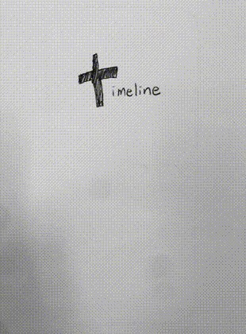

Timeline within timeline
=====
My response to the question: "What feature would you add to Facebook and why?"

I would add the ability to create a timeline within your own timeline. Why? Because some events have a life of their own, and pictures, comments and likes can come together in a better way to tell the story of that event.

Hey awesome people at Facebook! 
=====

Here's a visual outline of "timeline within timeline"

  Meet Peter. Peter is really involved in a new project: a drone that follows you around and takes photos of you. Vacation photos will never be the same. Peter creates a new timeline called “Photo Drone”. He adds a description: “The story of my billion dollar idea: meet Photo Drone!” His first posts are a link and screenshot of his product on Kickstarter. The Photo Drone timeline belongs to Peter and appears on his wall. Peter changes the security settings so that Photo Drone’s timeline is public, so he can reach a wider audience for funding, whilst Peter’s own timeline remains private. It’s not only Peter’s friends that can share, like and comment on Photo Drone’s timeline, but also those outside his network who are intrigued by Photo Drone.

  More photos are uploaded after the first prototype is made. Unfortunately, it overheats and catches fire after 10 minutes. He uploads the failed video. His friends comment and encourage him not to give up. He meets an awesome engineer named Hannah at hackathon and they collaborate to make Photo Drone better. She is added as an admin of the Photo Drone timeline and it appears on her wall too. They post funny photos of each other falling asleep at more hackathons on Photo Drone’s timeline. 

  “Timeline within timeline” changes the way Peter shares to his friends what he cares about. 

  The idea isn’t perfect. People may not want their social activities to be grouped into mini timelines and would rather have it all integrated in one place. It may be too troublesome and no one uses it. They may hate it! While I have faith in this feature, the best way to find out and improve would be to make it as good as we can, ship it, then adjust accordingly.

  I got excited and made a quick visual demo of my feature: github.com/loulai/timeline-within-timeline

  Thank you for considering me for such an exciting opportunity!

